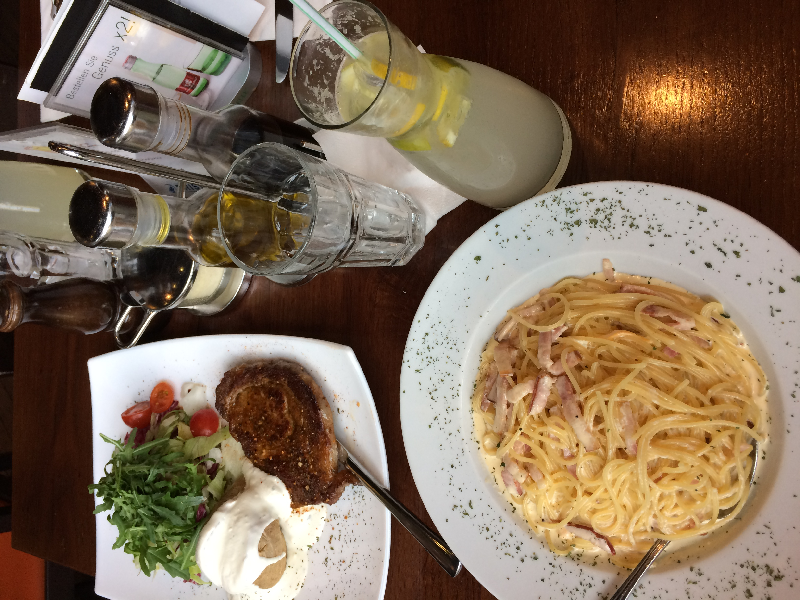

<head>
  <title>Mahsa's Page</title>
  
</head>
<body>
  <h1>Welcome to my page!</h1>
  
  <h3>About me</h3>
  
Mahsa (Zara) - Ph.D. in Data Science
Passionate About: Python, Machine Learning, and the Power of Data

  
Here is a link to my linkedin: <a href="https://www.linkedin.com/in/zahrakaramimehr/">LinkedIn</a>

  
I’ve been captivated by technology since the first year of guidance school when I got my hands on my very own PC. This early experience sparked my journey into the world of computers, leading me to pursue a degree in Computer Science at university. My growing interest in statistics and data analysis naturally guided me towards a career in Data Science, where I now blend creativity with analytical precision to unlock insights from data.

  <h3>Hobbies</h3>
  
When I'm not immersed in coding or data analysis, I love to stay active. You'll often find me swimming, hiking, biking, or practicing yoga. I also have a strategic side—I'm an avid board game enthusiast, with Backgammon being my favorite. These activities keep my mind sharp and my creativity flowing. 

  <h3>Fun Facts</h3>
  <ul class="fun-facts">
    <li> Almost an Animator: I originally wanted to become an animator, but my passion for data won out in the end.</li>
    <li>Name Game: My actual name is Zara, though most people know me as Mahsa.</li>
    <li>First Flight: I never set foot on a plane until I started college.</li>
    <li>Literary Love: I’m a huge fan of the <i>Harry Potter</i>series.</li>
    <li>Teenage Tunes: <i> Backstreet Boys</i> were my absolute favorite band growing up.</li>
  </ul>
  <h2>Social Media</h2>
    I am not really active on social media but in case you want to take a look at them:
   
  <ul class="socials">
    <li class="social instagram"><b>Instagram: </b><a href="https://www.instagram.com/mah5akmehr">My instagram</a></li>
    <li class="social twitter"><b>Twitter: </b><a href="https://x.com/MKaramimehr">My twitter</a></li>
    <li class="social linkedin"><b>LinkedIn: </b><a href="https://www.linkedin.com/in/zahrakaramimehr/">My linkedIn</a></li>
  </ul>
  <h2>Photos</h2>
  Here are a few photos from a trip to Europe I took 2 years ago:
  

    

      
    

    

      
    

    

      
    

  

  

  <h2> Table </h2>
  My universty  stats :
    
  <table class="hockey-stats">
      <thead>
          <tr>
              <th class="season" data-sort="">S</th>
              <th class="team" data-sort="team">Team</th>
              <th class="league" data-sort="league">League</th>
              <th class="regular gp" data-sort="gp">GP</th>
              <th class="regular g" data-sort="g">G</th>
              <th class="regular a" data-sort="a">A</th>
              <th class="regular tp" data-sort="tp">TP</th>
              <th class="regular pim" data-sort="pim">PIM</th>
              <th class="regular pm" data-sort="pm">+/-</th>
              <th class="separator">&nbsp;</th>
              <th class="postseason">POST</th>
              <th class="postseason gp" data-sort="playoffs-gp">GP</th>
              <th class="postseason g" data-sort="playoffs-g">G</th>
              <th class="postseason a" data-sort="playoffs-a">A</th>
              <th class="postseason tp" data-sort="playoffs-tp">TP</th>
              <th class="postseason pim" data-sort="playoffs-pim">PIM</th>
              <th class="postseason pm" data-sort="playoffs-pm">+/-</th>
          </tr>
      </thead>
      <tbody>
          <tr class="team-continent-NA ">
              <td class="season sorted">
                  2014-15
              </td>
              <td class="team">
                  <i></i>
                  
                      <a href="https://www.eliteprospects.com/team/10263/mit-mass.-inst.-of-tech./2014-2015?tab=stats"> MIT (Mass. Inst. of Tech.) </a>
                  
              </td>
              <td class="league"> <a href="https://www.eliteprospects.com/league/acha-ii/stats/2014-2015"> ACHA II </a> </td>
              <td class="regular gp">17</td>
              <td class="regular g">3</td>
              <td class="regular a">9</td>
              <td class="regular tp">12</td>
              <td class="regular pim">20</td>
              <td class="regular pm"></td>
              <td class="separator"> | </td>
              <td class="postseason">
                  
              </td>
              <td class="postseason gp">
              </td>
              <td class="postseason g">
              </td>
              <td class="postseason a">
              </td>
              <td class="postseason tp">
              </td>
              <td class="postseason pim">
              </td>
              <td class="postseason pm">
              </td>
          </tr>
          <tr class="team-continent-NA ">
              <td class="season sorted">
                  2015-16
              </td>
              <td class="team">
                  <i></i>
                  
                      <a href="https://www.eliteprospects.com/team/10263/mit-mass.-inst.-of-tech./2015-2016?tab=stats"> MIT (Mass. Inst. of Tech.) </a>
                  
              </td>
              <td class="league"> <a href="https://www.eliteprospects.com/league/acha-ii/stats/2015-2016"> ACHA II </a> </td>
              <td class="regular gp">9</td>
              <td class="regular g">1</td>
              <td class="regular a">1</td>
              <td class="regular tp">2</td>
              <td class="regular pim">2</td>
              <td class="regular pm"></td>
              <td class="separator"> | </td>
              <td class="postseason">
                  
              </td>
              <td class="postseason gp">
              </td>
              <td class="postseason g">
              </td>
              <td class="postseason a">
              </td>
              <td class="postseason tp">
              </td>
              <td class="postseason pim">
              </td>
              <td class="postseason pm">
              </td>
          </tr>
          <tr class="team-continent-NA ">
              <td class="season sorted">
                  2016-17
              </td>
              <td class="team">
                  <i></i>
                  
                      <a href="https://www.eliteprospects.com/team/10263/mit-mass.-inst.-of-tech./2016-2017?tab=stats"> MIT (Mass. Inst. of Tech.) </a>
                  
              </td>
              <td class="league"> <a href="https://www.eliteprospects.com/league/acha-ii/stats/2016-2017"> ACHA II </a> </td>
              <td class="regular gp">12</td>
              <td class="regular g">5</td>
              <td class="regular a">5</td>
              <td class="regular tp">10</td>
              <td class="regular pim">8</td>
              <td class="regular pm">0</td>
              <td class="separator"> | </td>
              <td class="postseason">
              </td>
              <td class="postseason gp">
              </td>
              <td class="postseason g">
              </td>
              <td class="postseason a">
              </td>
              <td class="postseason tp">
              </td>
              <td class="postseason pim">
              </td>
              <td class="postseason pm">
              </td>
          </tr>
          <tr class="team-continent-EU ">
              <td class="season sorted">
                  2017-18
              </td>
              <td class="team">
                  Did not play
              </td>
              <td class="league">  </td>
              <td class="regular gp"></td>
              <td class="regular g"></td>
              <td class="regular a"></td>
              <td class="regular tp"></td>
              <td class="regular pim"></td>
              <td class="regular pm"></td>
              <td class="separator"> | </td>
              <td class="postseason">
                  
              </td>
              <td class="postseason gp">
              </td>
              <td class="postseason g">
              </td>
              <td class="postseason a">
              </td>
              <td class="postseason tp">
              </td>
              <td class="postseason pim">
              </td>
              <td class="postseason pm">
              </td>
          </tr>
          <tr class="team-continent-NA ">
              <td class="season sorted">
                  2018-19
              </td>
              <td class="team">
                  <i></i>
                  
                      <a href="https://www.eliteprospects.com/team/10263/mit-mass.-inst.-of-tech./2018-2019?tab=stats"> MIT (Mass. Inst. of Tech.) </a>
                  
              </td>
              <td class="league"> <a href="https://www.eliteprospects.com/league/acha-iii/stats/2018-2019"> ACHA III </a> </td>
              <td class="regular gp">8</td>
              <td class="regular g">5</td>
              <td class="regular a">10</td>
              <td class="regular tp">15</td>
              <td class="regular pim">8</td>
              <td class="regular pm"></td>
              <td class="separator"> | </td>
              <td class="postseason">
                  
              </td>
              <td class="postseason gp">
              </td>
              <td class="postseason g">
              </td>
              <td class="postseason a">
              </td>
              <td class="postseason tp">
              </td>
              <td class="postseason pim">
              </td>
              <td class="postseason pm">
              </td>
          </tr>
      </tbody>
  </table>
  <h2>Mystery Message Challenge!</h2>
  
If you scrape the links below grabbing the &lt;p&gt; tag with id="secret-word", you'll discover a secret message :)

  

  

    <ul>
      <li><a href="challenge/file_1.html">File 1</a></li>
      <li><a href="challenge/file_2.html">File 2</a></li>
      <li><a href="challenge/file_3.html">File 3</a></li>
      <li><a href="challenge/file_4.html">File 4</a></li>
      <li><a href="challenge/file_5.html">File 5</a></li>
    </ul>
  

  

    <ul>
      <li><a href="challenge/file_6.html">File 6</a></li>
      <li><a href="challenge/file_7.html">File 7</a></li>
      <li><a href="challenge/file_8.html">File 8</a></li>
      <li><a href="challenge/file_9.html">File 9</a></li>
      <li><a href="challenge/file_10.html">File 10</a></li>
    </ul>
  

  

  <h2>Footnotes</h2>
  
1. This was actually a minivan that I named Debora. Maybe not my dream car, but I loved her nonetheless.

  </body>
